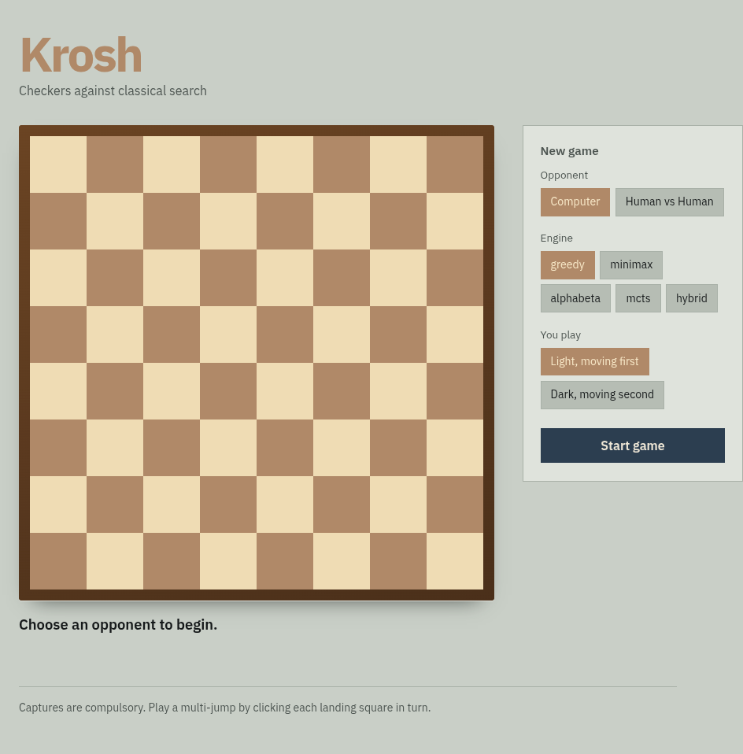
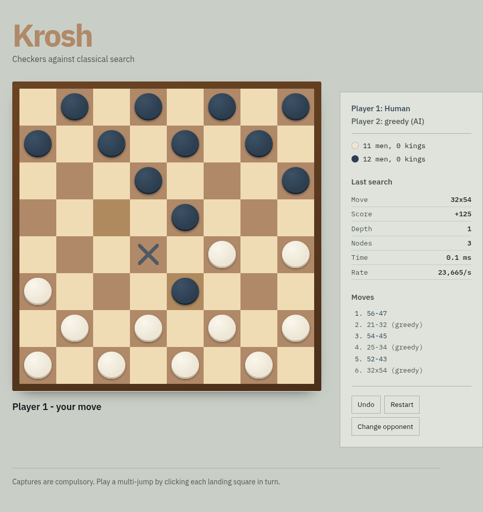
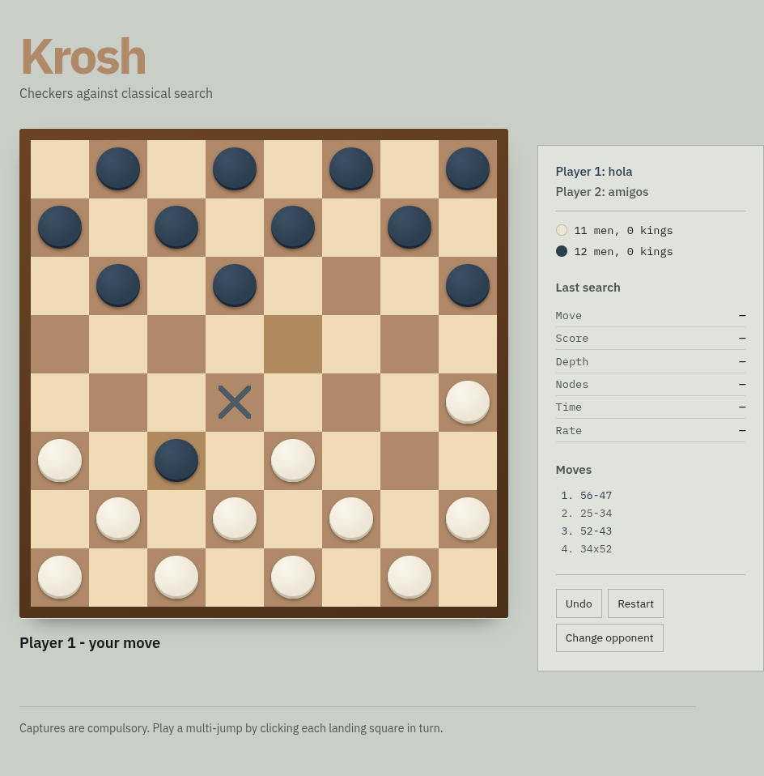

# KROSH

Checkers against five classical AI opponents — Greedy, Minimax, Alpha-Beta,
MCTS and a phase-switching Hybrid.

**CSE 3811 | AI Lab | Section A | Group 5**
Saber Hassan (112330870) · Sadia Islam Mim (112330721) · Adham Zarif (112330329)

**Play it online: [krosh.onrender.com](https://krosh.onrender.com/)**
The free instance sleeps after inactivity — the first load may take ~30 seconds.

> **All rights reserved.** This is coursework, not an open-source project.
> See [LICENSE](LICENSE). You may read this repository for reference; you may
> not reuse, modify or submit it, in whole or in part, as your own work.

---

## Screenshots



*Choosing an opponent, engine and colour. The engine list is generated from the
registry, so registering a new engine makes it appear here with no UI changes.*



*Mid-game against the Greedy engine. Markers show every legal destination, and
the side panel carries the live search payload from the last AI move.*



*Two players at one screen, with names shown as Player 1 and Player 2.*

---

## Quick start

On Arch and other PEP 668 distributions, use a virtual environment:

```bash
python -m venv .venv
source .venv/bin/activate
pip install -r requirements.txt
```

Then:

```bash
python run_web.py                   # play in a browser at 127.0.0.1:5000
python main.py                      # play in a desktop window
python -m pytest tests/ -q          # 131 tests
python scripts/perft_bench.py --depth 8
python scripts/arena.py --games 100
```

`requirements.txt` includes `pygame-ce`, not `pygame` — upstream pygame has no
Python 3.14 support and compiles to a build with a broken font module.
`requirements-web.txt` is the server-only subset used for deployment.

---

## Layout

```
krosh/
  core/              pure rules engine — no Pygame, no I/O
    constants.py     geometry, piece encoding, precomputed step/jump tables
    move.py          Move (immutable) and Undo records
    state.py         GameState: move generation, apply/undo, Zobrist, terminals
  engines/
    base.py          Engine interface + SearchResult stat payload
    evaluate.py      the single shared heuristic, with tunable Weights
    greedy.py        GreedyEngine (one-ply) and RandomEngine (test control)
    minimax.py       plain negamax, deliberately unoptimised baseline
    alphabeta.py     pruning, ordering, transposition table, quiescence, ID
    mcts.py          UCT with evaluation-backed, capture-biased rollouts
    hybrid.py        switches engine by game phase
    match.py         headless play_game / play_series drivers
  app/
    session.py       GameSession — turn logic, selection, AI dispatch
  web/
    server.py        Flask JSON API over GameSession
    templates/       page shell
    static/          stylesheet and browser client
  ui/
    theme.py         palette, geometry, fonts, vector crown
    board_view.py    board + piece rendering, click mapping
    sidebar.py       status, material, live search stats, move history
    menu.py          mode / opponent / colour selection
    app.py           main loop, threaded AI search
main.py              desktop entry point
run_web.py           browser entry point
render.yaml          deployment configuration
docs/                progress report, structure document, screenshots
tests/               Pytest suite
scripts/             benchmarks and report generation
```

---

## Architecture

```
web/  (Flask + browser)  ─┐
                          ├─>  app/GameSession  ->  engines/  ->  core/GameState
ui/   (Pygame desktop)   ─┘
```

Both frontends are thin. Every rule decision and every search runs in Python
behind `GameSession`, so the browser client never decides what is legal — it
draws the state it is given and posts clicks back. The engines the browser
plays against are the same objects the benchmark suite runs.

Nothing lower in the stack ever imports something higher. That is what allowed
the browser frontend to be added without touching a single line of the rules
or the AI.

The core is deliberately isolated from Pygame. Engines search it by mutating a
single board in place through `apply` / `undo` — no `deepcopy` anywhere — which
is what makes depth-12 Alpha-Beta and large MCTS budgets feasible.

In the desktop build the AI search runs on a worker thread, so the window keeps
rendering at 60 FPS while the engine thinks. In the web build the search runs
server-side, so the browser stays responsive for the same reason.

---

## Playing

Pick a mode: **Human vs AI** (choose the opponent engine and your colour) or
**Human vs Human** for two players at one screen.

Click a piece to select it; markers show every legal destination. Captures are
compulsory, so a piece with no legal move says so instead of selecting.
A multi-jump is played by clicking **each landing square in turn** — the piece
shows as a ghost mid-chain — which keeps two chains that share a first hop
unambiguous.

| key | action |
|-----|--------|
| `U` | undo (rolls back the AI reply too, so you are always on move) |
| `R` | restart |
| `ESC` | back to menu (desktop) |
| `Q` | quit (desktop) |

The side panel shows the live search payload from the last AI move: chosen
move, score, depth reached, nodes visited, elapsed time and nodes per second.

---

## Board representation

64-element flat list, index `row * 8 + col`. Piece values encode owner in the
sign and rank in the magnitude:

| value | meaning |
|-------|---------|
| `+2`  | Player 1 king |
| `+1`  | Player 1 man — moves toward row 0, moves first |
| `0`   | empty |
| `-1`  | Player 2 man — moves toward row 7 |
| `-2`  | Player 2 king |

A flat list is used internally because scalar access in the search hot loop is
roughly twice as fast as either nested lists or NumPy element access. Call
`GameState.matrix()` for the 8×8 `int8` NumPy view used by evaluation,
rendering and the benchmark report.

---

## Rules implemented

Standard English/American draughts:

- men step one square diagonally forward, kings one square any diagonal
- **capturing is compulsory** — if any capture exists, only captures are legal
- multi-jump chains are generated as a single `Move` and must be completed
- a man crowned mid-chain **ends its turn immediately**
- captured pieces are removed only at end of move, so they still block landing
  squares and cannot be jumped twice
- a player with no legal move loses
- 80 plies without a capture or a man move is a draw

---

## Correctness

`perft(depth)` counts leaf nodes from the opening position and is checked
against the published reference values for English draughts:

| depth | 1 | 2 | 3 | 4 | 5 | 6 | 7 | 8 |
|-------|---|---|---|---|---|---|---|---|
| nodes | 7 | 49 | 302 | 1469 | 7361 | 36768 | 179740 | 845931 |

Matching every one of these is far stronger evidence of rule correctness than
any hand-written scenario test, because a single misgenerated move anywhere in
the tree changes the totals. The suite also asserts that `undo` restores the
board, side to move, quiet-ply counter and Zobrist hash bit-for-bit.

Generation throughput is ~270k nodes/s single-threaded. **131 tests passing.**

---

## Engines

All engines score positions through `engines/evaluate.py`, so the benchmark
compares search strategies rather than five different notions of a good
position. Terms: material (man 100, king 175), advancement toward promotion,
back-row guard, centre control, edge safety, and an endgame "chase" term that
stops a winning side from shuffling into the 80-ply draw. Weights live in a
frozen `Weights` dataclass so the report can state exactly which configuration
produced which result.

| engine | search | notes |
|--------|--------|-------|
| **Greedy** | 1 ply | the control; judges a move by the board it leaves, not the reply |
| **Minimax** | fixed depth negamax | deliberately unoptimised, so Alpha-Beta's saving is measurable |
| **Alpha-Beta** | iterative deepening | pruning, move ordering, transposition table, killers, history, quiescence |
| **MCTS** | UCT | evaluation-backed cut-off rollouts, capture-biased playouts, seeded |
| **Hybrid** | phase-switching | shallow α-β opening, deep α-β midgame, heavy MCTS endgame |

### Measured results

Greedy scores **64%** against Random over 400 games. That gap is modest and it
is the honest result rather than a bug: with captures compulsory, material is
decided by the *reply*, which a one-ply engine cannot see. Greedy captures a
piece and is jumped back. This is precisely the weakness Minimax exists to fix.

Alpha-Beta prunes hard — 327 nodes against Minimax's 1,827 at depth 4.

Replacing Alpha-Beta's evaluation-based move ordering with static ordering made
it **3.6× faster** at identical strength (5–5 over 10 games at equal depth):

| depth 8 | nodes | time | nodes/sec |
|---------|------:|-----:|----------:|
| evaluation ordering | 19,919 | 3.67 s | 5,427 |
| static ordering | 18,109 | 1.01 s | 17,959 |

MCTS originally scored every rollout as a draw — a 20-ply cap meant 100% of
playouts ended undecided, and `winner()` returns `None` for an unfinished game.
Scoring cut-off rollouts with the evaluation function, correcting the
perspective at opponent nodes, and biasing playouts toward captures gave
**7–1–2 against the previous version at an identical simulation budget**.

Benchmark it yourself:

```bash
python scripts/arena.py --games 100 --csv results.csv
```

---

## Web API

Games live in server memory keyed by an id the browser holds, so restarting the
server clears any game in progress. Idle games are evicted after an hour and
the total is capped, so a hosted instance does not leak memory.

| method | route | purpose |
|--------|-------|---------|
| `POST` | `/api/game` | start a game, returns `game_id` |
| `GET` | `/api/game/<id>` | current state |
| `POST` | `/api/game/<id>/click` | send a board click |
| `POST` | `/api/game/<id>/ai` | let the engine move, returns search stats |
| `POST` | `/api/game/<id>/undo` | roll back to the player |
| `POST` | `/api/game/<id>/reset` | restart the position |
| `GET` | `/healthz` | liveness probe |

Deployment runs under gunicorn with **one worker** — games are held in process
memory, so a second worker would not recognise a game started on the first.

---

## Status

- [x] Rules core — apply/undo, compulsory captures, perft verification
- [x] Evaluation function and Greedy agent
- [x] Minimax with search-stat instrumentation
- [x] Alpha-Beta — ordering, transposition table, quiescence, iterative deepening
- [x] MCTS — UCT, evaluation-backed rollouts, seeded
- [x] Hybrid phase-switching engine
- [x] Pygame desktop frontend and Flask browser frontend
- [x] Online deployment
- [ ] Full benchmark suite and comparison report

---

## Notes from development

The original prototype this project started from contained three defects,
corrected in the core:

- kinging applied to *any* piece reaching row 0 or row 7, so a king walking
  back to its own row was re-crowned and inflated the king counter
- `skipped=[]` was a mutable default argument shared across all calls
- captures were optional, and there was no draw or stalemate detection
